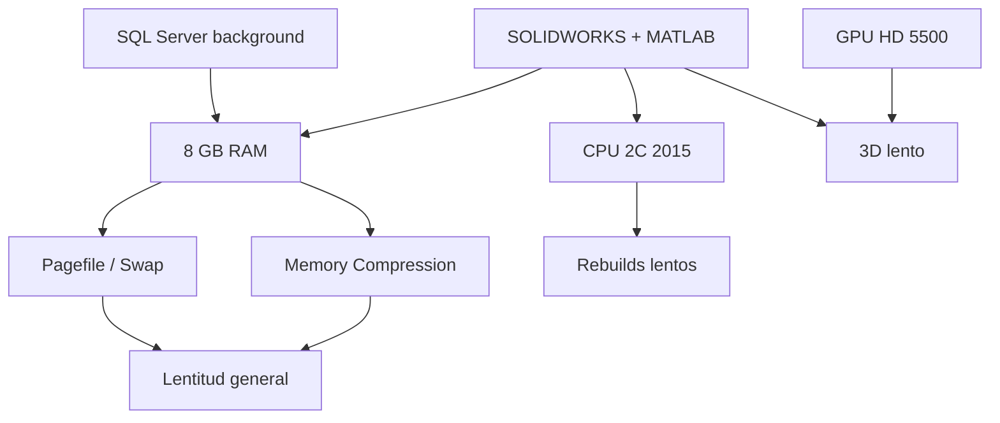

# 04 — Cuellos de botella identificados

## Matriz de impacto

| ID | Cuello de botella | Severidad | Evidencia |
|----|-------------------|-----------|-----------|
| B1 | **RAM insuficiente (8 GB)** | 🔴 Crítica | Memory Compression activa; pagefile 7.5 GB; SW/MATLAB reqs |
| B2 | **Stack software pesado** | 🔴 Crítica | SOLIDWORKS suite + MATLAB R2025b + SQL Server 2022 |
| B3 | **CPU 5ª generación** | 🟠 Alta | i7-5600U al 91% sin CAD; 2C/4T limitados |
| B4 | **GPU integrada HD 5500** | 🟡 Media | Visualize/render 3D lentos |
| B5 | **Disco al 76%** | 🟡 Media | 109 GB libres; riesgo con temp CAD |
| B6 | **SQL Server en background** | 🟡 Media | Motor DB corriendo sin uso aparente |
| B7 | **Múltiples instancias Cursor/Edge** | 🟢 Baja | ~2 GB RAM en herramientas dev/browser |

---

## B1 — RAM (crítico)

**Síntomas esperados**:
- Sistema lento al cambiar entre apps
- Ventanas que tardan en responder
- Disco LED activo constante (swap)
- Cierres inesperados con "memoria insuficiente"

**Causa raíz**: 8 GB vs requisitos de software instalado (16+ GB recomendado).

**Solución**: Hardware (16 GB DDR3L) + hábitos de uso.

---

## B2 — Software stack (crítico)

**Síntomas**:
- Lentitud proporcional al número de apps de ingeniería abiertas
- Primer arranque del día muy lento

**Causa raíz**: Suite SOLIDWORKS 2024 completa instalada; cada módulo añade carga. MATLAB R2025b es la versión más reciente en hardware antiguo.

**Solución**: Desinstalar módulos no usados; no ejecutar en paralelo; considerar versiones más ligeras donde sea posible.

---

## B3 — CPU (alta)

**Síntomas**:
- Rebuilds/regeneraciones lentas en CAD
- MATLAB con datasets medianos se traba

**Causa raíz**: Arquitectura 2015, TDP 15W, 2 núcleos reales.

**Solución**: Mitigable con RAM y hábitos; no resoluble sin nuevo equipo.

---

## B4 — GPU (media)

**Síntomas**:
- Rotación 3D entrecortada en SOLIDWORKS
- Visualize impracticable

**Solución**: Reducir calidad gráfica en SW (Tools → Options → Performance → OpenGL); desactivar RealView/Shadows.

---

## B5 — Espacio en disco (media)

**Síntomas**:
- Actualizaciones Windows fallan
- Temp files de CAD llenan disco

**Solución**: Liberar espacio; mover proyectos a disco externo; Disk Cleanup.

---

## B6 — SQL Server (media)

**Síntomas**:
- RAM consumida sin app SQL abierta
- Servicios adicionales al boot

**Solución**: `services.msc` → SQL Server → Manual/Deshabilitado si no se usa.

---

## Diagrama causal

